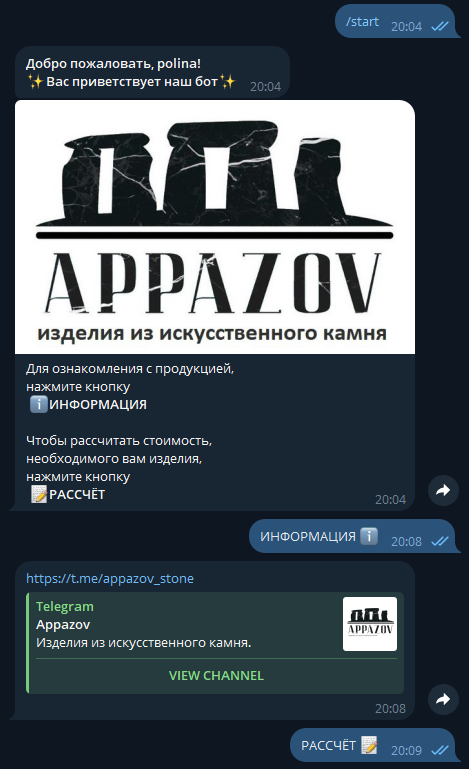
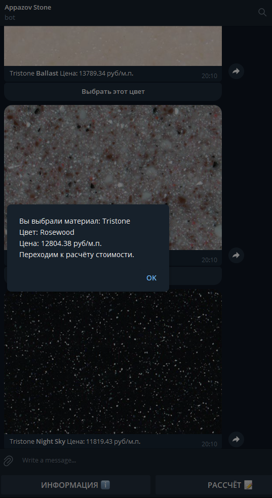
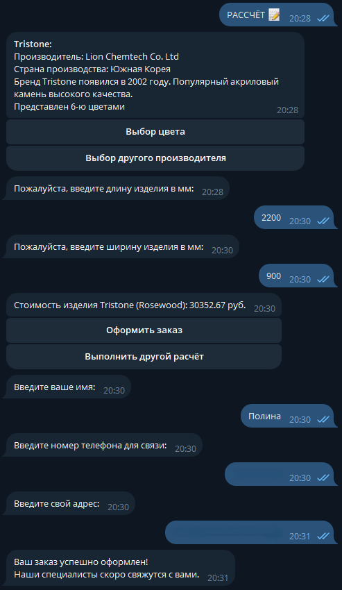
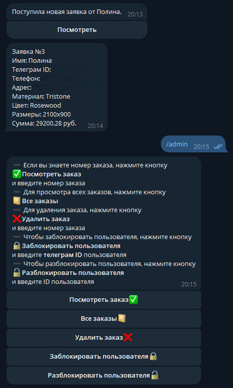

# StoneSellerBot

This bot obtain order for making artificial stone and send order to bot's owner. 
The user receives information about the material and colors from db, using `SQLAlchemy`, with price convertible from dollars to rubles, using the `yfinance` module.
After that enters the required dimensions and receives the order sum. Until the order is confirmed, the required information is stored in the FSM state, and after confirmation, it is saved in db.
The bot owner receives a message about the created order with the required information from db.
Also there is abilities to manage orders and to block users by administrators.

## Getting Started

These instructions will help you get a copy of the project up and running on your local machine for development and testing purposes.

The application is developed using Python 3.11 and the corresponding requirements. It is not guaranteed to work with other versions of Python.

### Prerequisites

To get started, you'll need to have Python 3.11 installed along with `pip`. If you don't have them, please install Python from the [official website](https://www.python.org/downloads/).

### Installing

1. **Clone the repository:**

    First, clone the repository to your local machine:
    
    ```bash
    git clone https://github.com/Art21042147/stone_seller_ai_3
    cd Stone_seller_bot
    ```

2. **Create and activate a virtual environment:**

    Create a virtual environment to manage dependencies:
    
    ```bash
    python -m venv .venv
    ```

    Activate the virtual environment:
    - On Windows:
      ```bash
      .venv\Scripts\activate
      ```
    - On macOS/Linux:
      ```bash
      source .venv/bin/activate
      ```

3. **Install required dependencies:**

    Install the necessary Python packages using pip:
    
    ```bash
    pip install -r requirements.txt
    ```

4. **Environment variables:**

    Create a `.env` file in the root directory:
    
    ```
    BOT_TOKEN = your bot token

    ADMIN_ID = your tg id
    ```

5. **Run the application:**

    After setting everything up, you can start the application with:

    ```bash
    python bot.py
    ```

## Project Structure

- **`db:`** Database management modules.
- **`handlers:`** Handlers modules.
- **`media:`** Images of stones and logo.
- **`service:`** Modules for obtaining stone prices.
- **`tests:`** Unit testing.
- **`bot.py:`** The entry point for running the bot.
- **`config_reader.py:`** Passing environment variables.
- **`keyboards.py:`** Bot's keyboards.
- **`middlewares.py:`** Checking user's ban.
- **`states.py:`** Bot's states.

## Built With

* [aiogram 3](https://docs.aiogram.dev/en/v3.20.0.post0/)
* [SQLAlchemy](https://www.sqlalchemy.org/)
* [yfinance](https://pypi.org/project/yfinance/)

## Screenshots

### Main menu
The main menu of the bot contains basic information about the bot and a link to the craftsman's channel.



---

### Calc Menu
Menu for calculating.



---

### Orders Menu
Menu for ordering.



---

### Admin Panel
Bot's manager.




## Authors

* **Arthur Ilin** - *Core development and implementation* - [Art21042147](https://github.com/Art21042147)
